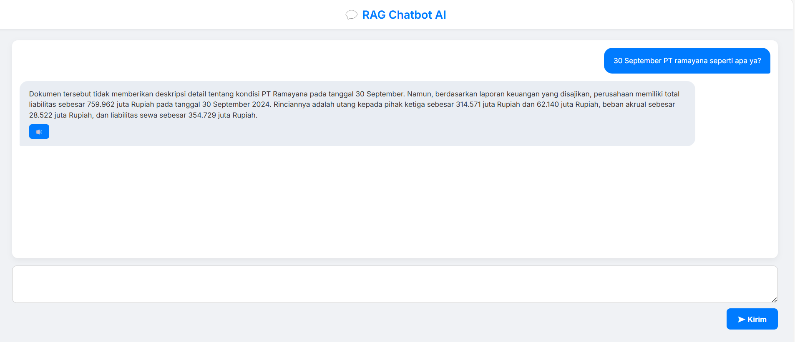

# Introduction
This is a simple chatbot AI. I use ChromaDB to store my vector data. After that, I use OpenAI to generate responses using a Retrieval-Augmented Generation (RAG) system. This means that when a user asks a question, the AI will search for similar context in ChromaDB before generating an answer.

Run with : python -m uvicorn main:app --host 0.0.0.0 --port 9000 --reload
